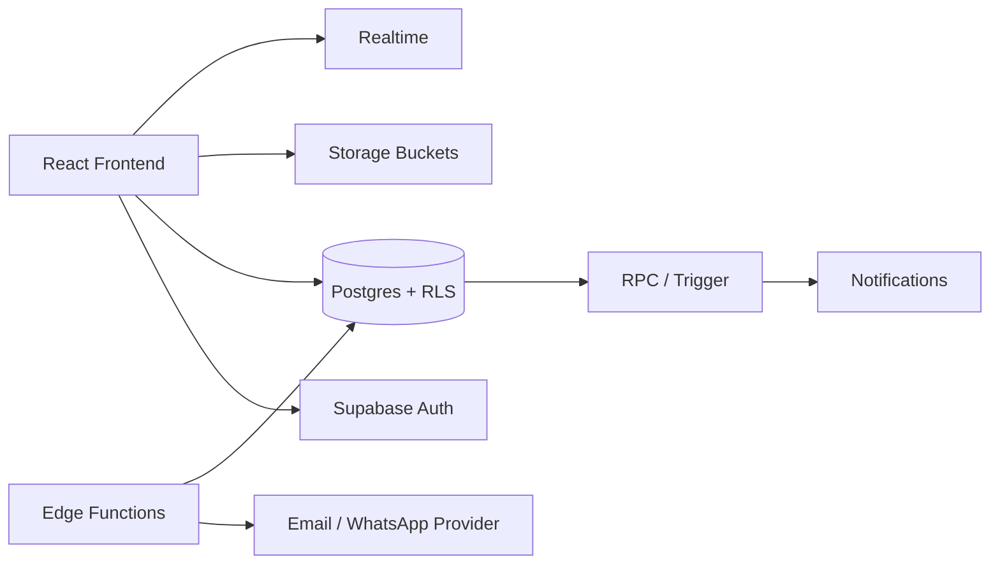
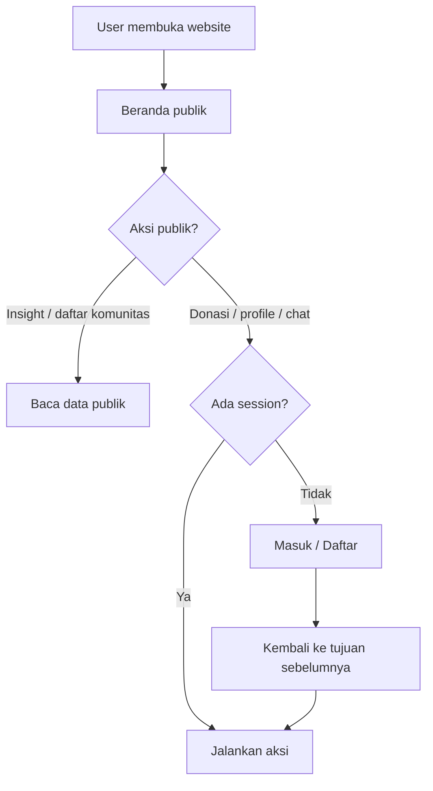
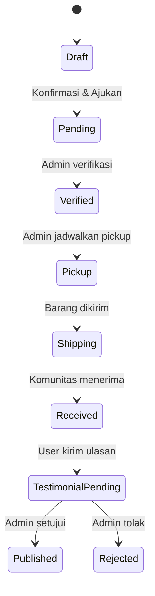
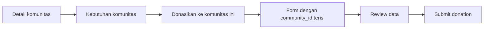
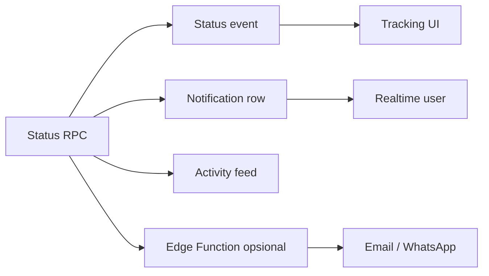

# Backend Specification — KEMBALI

Dokumen ini adalah spesifikasi implementasi backend final untuk website KEMBALI. Setelah frontend selesai dan field pada setiap form sudah dikunci, berikan dokumen ini kepada agent backend dengan instruksi: **"Implementasikan backend Supabase sesuai `backend.md`, jalankan migration, seed data, RLS, RPC, Storage, Realtime, dan integrasikan service frontend sesuai kontrak dokumen ini."**

Dokumen ini menjadi sumber kebenaran untuk schema database, aturan akses, alur status, API/RPC, dan integrasi Supabase. Catatan tentang frontend di bawah hanya berfungsi sebagai prasyarat integrasi—bukan laporan bahwa backend sudah berjalan.

## Stack dan prinsip

- React + Vite: frontend yang sudah ada.
- Supabase Auth: session dan autentikasi.
- Supabase Postgres: database aplikasi.
- Supabase Storage: foto barang, avatar, logo komunitas, media artikel.
- Supabase Realtime: tracking donasi, notifikasi, dan chat.
- Supabase Edge Functions: logic server-side dan integrasi provider email/WhatsApp.

> Browser hanya memakai publishable/anon key. `service_role` key hanya di Edge Function/server terpercaya. Jangan pernah memasukkannya ke bundle Vite.

---

## 1. Prasyarat sebelum implementasi

Backend dikerjakan setelah frontend menyelesaikan hal berikut:

- route dan nama halaman final;
- field Form Donasi, Profile, Auth, Insight, Komunitas, dan Testimoni;
- state loading, empty, error, dan success pada setiap aksi;
- kebutuhan role: user/donor, manager komunitas, moderator, dan admin;
- mapping komponen ke service pada bagian **Kontrak service frontend**.

Jika field UI berbeda dari schema di dokumen ini, agent harus memperbarui kontrak dan migration terlebih dahulu, lalu meminta konfirmasi tim sebelum membuat tabel baru. Jangan membuat backend berdasarkan tebakan dari tampilan sementara.

### Perintah implementasi untuk agent

1. Baca `userflow.md` dan seluruh `backend.md`.
2. Audit route, form, dan data contract frontend yang sudah final.
3. Buat project client Supabase, migration, seed, RLS, RPC, Storage, dan Realtime sesuai urutan dokumen.
4. Implementasikan service frontend dan ganti mock/local state dengan query Supabase.
5. Jalankan pengujian role dan alur donasi dari awal sampai selesai.
6. Laporkan file yang dibuat, migration yang dijalankan, environment variable yang dibutuhkan, dan fitur yang masih tertunda.

Target arsitektur:



---

## 2. Alur website yang menjadi kontrak backend

### 2.1 Guest dan login



Guest boleh membaca Beranda, Insight, detail artikel, daftar komunitas terverifikasi, kebutuhan komunitas, dan tautan sosial. Login diperlukan untuk membuat donasi, melihat tracking, membuka profile, mengirim testimoni, dan memakai chat.

### 2.2 Siklus donasi



Aturan inti:

1. Draft boleh disimpan sementara di FE sebelum submit final.
2. Submit membuat `donation_code` dan event `pending` dalam satu transaksi.
3. Setelah `pending`, status hanya berubah melalui RPC admin/manager.
4. Setiap perubahan status membuat event timeline dan notifikasi.
5. Testimoni baru boleh dibuat ketika donasi berstatus `received`.

### 2.3 Donasi dari komunitas



RPC harus memvalidasi ulang `community_id`: komunitas harus aktif dan terverifikasi. Jangan mempercayai nilai role, owner, atau komunitas hanya dari browser.

---

## 3. Modul dan route target

| Modul | Route target | Akses | Data utama |
| --- | --- | --- | --- |
| Beranda | `/` | Publik | statistik, artikel, komunitas, testimoni |
| Auth | `/auth` | Publik | Supabase Auth |
| Donasi | `/donasi` | Baca publik; submit perlu login | komunitas, kebutuhan, donasi |
| Tracking | `/donasi/:donationCode` | Pemilik/admin | donasi + status events |
| Profile | `/profile` | Login | profile, settings, donasi, notifikasi |
| Insight | `/insight` | Publik | articles |
| Detail artikel | `/insight/:slug` | Publik | articles |
| Komunitas | `/komunitas` | Publik | communities + needs |
| Chat | `/komunitas/:id/chat` | Login | rooms, members, messages |
| Admin | `/admin/*` | Admin | moderasi dan transisi status |

Route yang belum ada boleh dibuat setelah UI selesai. Schema backend ini menjadi target agar FE dapat berkembang tanpa mengganti nama tabel/status di tengah jalan.

---

## 4. Model data

Semua tabel memakai UUID dan timestamp UTC. Jalankan melalui migration SQL di repository, bukan membuat tabel manual tanpa riwayat.

### 4.1 Auth dan profile

#### `profiles`

Satu profile untuk setiap `auth.users`. Kredensial tetap dikelola Supabase Auth.

| Kolom | Tipe | Keterangan |
| --- | --- | --- |
| `id` | uuid PK/FK | sama dengan `auth.users.id` |
| `username` | text unique | nama publik |
| `full_name` | text | nama lengkap |
| `phone` | text unique nullable | format E.164 |
| `address` | text nullable | alamat pickup/pengiriman |
| `avatar_path` | text nullable | path Storage, bukan URL permanen |
| `birth_date` | date nullable | |
| `role` | text | `user`, `manager`, `admin` |
| `verification_status` | text | `unverified`, `processing`, `verified` |
| `phone_verified_at` | timestamptz nullable | |
| `created_at` / `updated_at` | timestamptz | dikelola database |

#### `profile_settings`

`user_id`, `privacy_level`, `contribution_visibility`, `general_location`, `impact_report`, `donation_history`, dan `notification_preferences jsonb`.

### 4.2 Komunitas

#### `communities`

`id`, `name`, `slug unique`, `description`, `location`, `address`, `logo_path`, `social_links jsonb`, `manager_id`, `is_verified`, `is_active`, timestamps.

#### `community_needs`

`id`, `community_id`, `category`, `item_name`, `description`, `quantity_needed`, `quantity_received`, `status` (`open`, `fulfilled`, `archived`), timestamps.

Kategori resmi:

```text
barang_bekas | pakaian_layak | buku_atk | karya_daur_ulang
```

#### `donation_channels`

Saluran donasi alternatif komunitas: drop point, alamat resmi, rekening, atau kontak. Data hanya dapat diubah manager/admin.

### 4.3 Donasi dan tracking

#### `donations`

| Kolom | Keterangan |
| --- | --- |
| `id` | UUID internal |
| `donation_code` | kode publik unik, misalnya `KMB-2026-00001` |
| `donor_id` | `profiles.id` |
| `community_id` | komunitas penerima |
| `need_id` | kebutuhan yang dipilih, nullable |
| `category`, `item_name`, `condition_note` | detail barang |
| `quantity` | integer lebih besar dari 0 |
| `description` | deskripsi tambahan |
| `pickup_address` | snapshot alamat saat submit |
| `pickup_at` | jadwal pickup/pengiriman, nullable |
| `status` | `pending`, `verified`, `pickup`, `shipping`, `received`, `cancelled` |
| `submitted_at`, `received_at` | waktu status terkait |
| `created_at`, `updated_at` | timestamp |

#### `donation_items`

`id`, `donation_id`, `storage_path`, `sort_order`. Binary foto berada di Storage, bukan di Postgres.

#### `donation_status_events`

`id`, `donation_id`, `from_status`, `to_status`, `note`, `changed_by`, `created_at`. Inilah sumber timeline tracking.

### 4.4 Konten dan aktivitas

| Tabel | Fungsi |
| --- | --- |
| `articles` | Insight: title, slug, content, cover, category, author, published_at |
| `testimonials` | Ulasan setelah `received`, menunggu moderasi |
| `notifications` | Notifikasi per user dan `is_read` |
| `activity_feed` | Aktivitas publik yang sudah disanitasi |
| `impact_statistics` | Angka dampak di Beranda |
| `newsletter_subscribers` | Email newsletter dan status unsubscribe |

### 4.5 Chat target

Chat komunitas sekarang memakai `chat_rooms`, `chat_members`, dan `chat_messages`. RPC `get_or_create_community_chat_room` membuat/mendaftarkan membership secara atomik berdasarkan slug komunitas. Frontend mengambil pesan dari Supabase dan berlangganan INSERT Realtime berdasarkan `room_id`; cleanup channel dilakukan saat pindah komunitas/unmount. Guest hanya dapat melihat tampilan, sedangkan pengiriman pesan memerlukan session.

`live_chat_threads` tetap disiapkan untuk chat dukungan langsung dengan admin/manager dan belum menjadi panel terpisah. Semua read/write pesan dibatasi membership melalui RLS.

---

## 5. Migration dan aturan database

Urutan migration:

```text
0001_extensions_and_helpers
0002_profiles_and_profile_settings
0003_communities_and_needs
0004_donations_and_status_events
0005_notifications_activity_statistics
0006_articles_testimonials_newsletter
0007_chat
0008_storage_realtime_policies
```

Aturan:

- Tambahkan index untuk semua FK, `donation_code`, `communities.slug`, `articles.slug`, `category`, `location`, dan `status`.
- Validasi `quantity > 0`, jumlah diterima tidak negatif, dan jumlah diterima tidak melebihi kebutuhan.
- Gunakan `on delete restrict` untuk donasi historis; gunakan cascade hanya untuk data anak yang memang tidak bermakna tanpa parent.
- `donation_code`, `status`, role, approval, dan statistik global dibuat/diubah backend.
- Gunakan satu penamaan status dan kategori di migration, RPC, service FE, dan UI.

### 5.1 Trigger profile

Gunakan trigger setelah insert `auth.users`. Function `security definer` harus memakai `set search_path = ''` dan nama schema lengkap.

```sql
create or replace function public.handle_new_user()
returns trigger
language plpgsql
security definer set search_path = ''
as $$
begin
  insert into public.profiles (id, full_name, username)
  values (
    new.id,
    coalesce(new.raw_user_meta_data ->> 'full_name', ''),
    coalesce(new.raw_user_meta_data ->> 'username', 'user-' || left(new.id::text, 8))
  );

  insert into public.profile_settings (user_id) values (new.id);
  return new;
end;
$$;
```

Uji trigger di project development sebelum dipakai production.

### 5.2 RPC submit donasi

Buat `submit_donation(payload jsonb)` agar submit tidak terdiri dari banyak request terpisah. RPC harus:

1. Memastikan `auth.uid()` tersedia.
2. Memastikan komunitas aktif dan terverifikasi.
3. Memvalidasi kategori, quantity, dan data wajib.
4. Membuat `donation_code`.
5. Insert `donations` berstatus `pending`.
6. Insert event `pending`.
7. Membuat notifikasi.
8. Mengembalikan `id`, `donation_code`, dan `status`.

Buat `claim_donation(donation_id, claim)` agar satu donasi hanya ditangani satu admin/manager pada saat yang sama. RPC mengunci baris donasi (`FOR UPDATE`), menolak pengambilalihan tugas yang sedang dipegang petugas lain, dan mengizinkan petugas yang sama melepas tugasnya.

Buat `transition_donation_status(donation_id, next_status, note)` untuk admin/manager. RPC memiliki daftar transisi yang diizinkan, mewajibkan petugas mengambil tugas terlebih dahulu, mengunci baris donasi, lalu menulis perubahan status, audit event, dan notification dalam satu transaksi. Assignment otomatis dilepas saat status menjadi `received` atau `cancelled`.

---

## 6. Row Level Security (RLS)

RLS wajib aktif sebelum frontend membaca tabel.

| Tabel | Guest | User login | Manager | Admin |
| --- | --- | --- | --- | --- |
| `profiles` | Tidak/field publik terbatas | Baca/update milik sendiri | Sesuai komunitas | Sesuai tugas |
| `communities` | Baca aktif + verified | Sama | CRUD komunitas sendiri | CRUD semua |
| `community_needs` | Baca `open` | Sama | CRUD komunitas sendiri | CRUD semua |
| `donations` | Tidak | Insert/baca milik sendiri | Baca/update komunitas sendiri | Kelola semua |
| `donation_status_events` | Tidak | Baca donasi sendiri | Baca/insert komunitas sendiri | Semua |
| `notifications` | Tidak | Baca/update milik sendiri | Milik sendiri | Sistem |
| `articles` | Baca published | Sama | Tidak | CRUD |
| `testimonials` | Baca approved | Insert milik sendiri setelah received | Tidak | Moderasi |
| `chat_messages` | Tidak | Hanya member room | Manager room | Audit/admin |

Contoh policy profile:

```sql
alter table public.profiles enable row level security;

create policy "authenticated users read profiles"
on public.profiles for select to authenticated
using (true);

create policy "users update their own profile"
on public.profiles for update to authenticated
using ((select auth.uid()) = id)
with check ((select auth.uid()) = id);
```

Untuk `UPDATE`, policy `SELECT` yang sesuai juga diperlukan. Kolom `role`, `verification_status`, `is_approved`, dan status donasi tidak boleh dinaikkan oleh user biasa.

### Pengujian RLS minimum

Uji sebagai anon, User A, User B, manager, dan admin. User A tidak boleh membaca atau mengubah donasi User B. User biasa tidak boleh mengubah status, role, approval testimoni, atau statistik global.

---

## 7. Auth dan verifikasi

### Fase awal

Implementasikan dulu flow yang paling stabil:

```text
Email + password → email confirmation sesuai setting → session → profiles
```

`AuthContext` harus mengganti localStorage dengan:

- `supabase.auth.signUp`
- `supabase.auth.signInWithPassword`
- `supabase.auth.signOut`
- `supabase.auth.onAuthStateChange`
- `supabase.auth.resetPasswordForEmail`

Tambahkan state `initialized` agar route private tidak merender sebelum session selesai dimuat. Session Supabase adalah sumber kebenaran production.

### Nomor HP dan WhatsApp OTP

Userflow meminta login nomor HP serta OTP email/WhatsApp. Kerjakan setelah email auth stabil:

- Phone Auth mengikuti provider phone/SMS yang didukung Supabase.
- WhatsApp membutuhkan Edge Function dan provider eksternal; secret tidak boleh berada di browser.
- OTP custom harus di-hash, punya expiry pendek, batas percobaan, dan hanya sekali pakai.
- Jangan mengubah `phone_verified_at` hanya karena form OTP terkirim.

Setelah login, simpan tujuan seperti `/donasi?community_id=...` dan kembalikan user ke tujuan tersebut. Jangan menyimpan password atau token manual di localStorage.

---

## 8. Storage dan Realtime

### Storage buckets

| Bucket | Isi | Akses |
| --- | --- | --- |
| `item-photos` | Foto barang | Upload user login; baca pemilik/admin/manager terkait |
| `profile-photos` | Avatar | Upload pemilik; baca sesuai privacy |
| `community-assets` | Logo komunitas | Baca publik; upload manager/admin |
| `article-media` | Cover artikel | Baca published; upload admin |
| `documentation-media` | Foto/video kegiatan | Baca publik sesuai status; upload admin/manager |

Gunakan path ownership, misalnya `{user_id}/{donation_id}/{uuid}.webp`. Validasi MIME, ukuran, dan jumlah file. Bucket private memakai signed URL.

### Realtime

Aktifkan hanya untuk `donations`, `donation_status_events`, `notifications`, `chat_messages`, dan `activity_feed` bila memang dipakai. Filter berdasarkan `user_id`, `donation_id`, atau `room_id`. Subscription React harus di-unsubscribe saat unmount.



---

## 9. Kontrak service frontend

Buat query terpusat di `src/lib/supabase/`, bukan di component UI:

```text
src/lib/supabase/client.js
src/lib/supabase/auth.js
src/lib/supabase/profile.js
src/lib/supabase/communities.js
src/lib/supabase/donations.js
src/lib/supabase/insight.js
src/lib/supabase/notifications.js
```

Minimal service:

| Service | Function |
| --- | --- |
| Auth | `signUp`, `signIn`, `signOut`, `resetPassword` |
| Profile | `getMyProfile`, `updateMyProfile`, `uploadAvatar` |
| Community | `listVerifiedCommunities`, `listOpenNeeds`, `getCommunityDetail` |
| Donation | `submitDonation`, `getMyDonations`, `getDonationByCode`, `subscribeDonation` |
| Content | `listPublishedArticles`, `getArticleBySlug` |
| Testimonial | `createTestimonial` |
| Notification | `listMyNotifications`, `markNotificationRead` |

Semua service mengembalikan bentuk yang konsisten:

```js
{ data: null, error: null }
```

---

## 10. Setup Supabase

### Dependency dan environment

```bash
npm install @supabase/supabase-js
```

`.env.local` (jangan commit):

```env
VITE_SUPABASE_URL=https://<project-ref>.supabase.co
VITE_SUPABASE_PUBLISHABLE_KEY=<publishable-or-anon-key>
```

Secret provider WhatsApp/email dan `service_role` disimpan sebagai Supabase Edge Function secrets.

### Checklist dashboard

1. Buat project development.
2. Atur Site URL dan redirect URL local/production.
3. Aktifkan metode Auth yang sudah siap.
4. Jalankan migration berurutan.
5. Aktifkan RLS dan policy.
6. Buat bucket dan policy Storage.
7. Aktifkan publication Realtime untuk tabel yang diperlukan.
8. Seed Sedekas, Dipo Waste Bank, Panti Asuhan Al Jannah, dan Panti Asuhan Kristen Tanah Putih.

---

## Status implementasi saat ini

Bagian berikut adalah status yang sudah diverifikasi di frontend dan Supabase project development:

| Fitur | Status | Catatan |
| --- | --- | --- |
| Supabase Auth email/password | ✅ Selesai | Login, register, logout, session restore; username memakai RPC `lookup_email_by_username` agar dapat dicari sebelum autentikasi |
| Turnstile pada login | ✅ Selesai | Verifikasi melalui Edge Function verify-turnstile |
| Reset password email | ✅ Selesai | Link email Supabase, recovery session, update password |
| Profile edit | ✅ Selesai | Update nama, username, email profile, telepon, tanggal lahir, dan alamat |
| Avatar | ✅ Selesai | Upload, positioning, refresh state, dan hapus dari Storage |
| Picker lokasi | ✅ Selesai | Provinsi → kota/kabupaten → kecamatan → kelurahan |
| Privacy settings | ✅ Selesai | Load/save 4 toggle ke profile_settings; efek visibilitas diterapkan pada overview dan riwayat profil |
| Delete account | ✅ Selesai | Edge Function delete-account terdeploy; menghapus data user, foto Storage, profil, dan Auth user secara permanen |
| Change password/email | ✅ Selesai | Re-authentication dan update Auth |
| OTP nomor telepon (Twilio) | ⏳ Terjadwal 21 Agustus 2026 | Saat ini masih mode demo; SMS real belum diaktifkan |
| Artikel dan statistik Beranda | ⏳ Sebagian | Sebagian masih berasal dari data frontend |
| Aktivitas dan riwayat donasi | ⚠️ FE wired | Menggunakan `donationService`; query remote sudah aktif, pembaruan Realtime masih perlu diuji lintas akun |
| Chat komunitas | ✅ FE wired | Room/membership RPC, baca/kirim/edit/reply pesan, dan Realtime `chat_messages` |
| Admin dashboard | ⚠️ FE wired | `/admin` memiliki monitoring, antrean prioritas, tab status, pencarian, detail foto, ambil/lepas tugas, konfirmasi transisi, dan audit aktivitas; jalankan migration 0021 |
| Admin, chat, realtime donasi | ⏳ Sebagian | Dashboard admin dan chat komunitas sudah tersedia; live support/thread admin masih perlu diuji |

Status ini bukan pengganti pengujian backend. Setelah agent backend menjalankan migration/RLS, ulangi test dengan akun anon, user biasa, manager, dan admin.

---

## Handoff untuk anggota tim

### Environment frontend

Setiap anggota tim harus membuat file .env.local sendiri di root repository. File ini tidak boleh di-commit:

~~~env
VITE_SUPABASE_URL=https://<project-ref>.supabase.co
VITE_SUPABASE_PUBLISHABLE_KEY=<publishable-or-anon-key>
VITE_TURNSTILE_SITE_KEY=<cloudflare-turnstile-site-key>
~~~

Nilai VITE_* diperlukan agar frontend dapat berjalan dan terhubung ke Supabase project development. Berikan nilai dari project development kepada anggota tim melalui password manager atau kanal privat, bukan commit Git/public chat.

Nilai yang boleh berada di frontend:

- VITE_SUPABASE_URL
- VITE_SUPABASE_PUBLISHABLE_KEY atau anon key
- VITE_TURNSTILE_SITE_KEY

Nilai yang tidak boleh dibagikan atau dimasukkan ke .env.local frontend:

- SUPABASE_SERVICE_ROLE_KEY
- TURNSTILE_SECRET_KEY
- password database
- token provider email/WhatsApp
- kredensial Twilio

service_role dan secret provider hanya disimpan sebagai Supabase Edge Function secrets.

### Menjalankan project dari clone baru

~~~bash
npm install
cp .env.example .env.local
# isi nilai VITE_* di .env.local
npm run dev
~~~

Buka URL Vite yang ditampilkan terminal, biasanya:

~~~text
http://localhost:5173
~~~

Jika memakai Turnstile, hostname localhost harus terdaftar pada widget Cloudflare. Redirect URL Supabase juga harus memuat:

~~~text
http://localhost:5173/reset-password
http://127.0.0.1:5173/reset-password
~~~

### Kapan perlu akses Supabase CLI

Untuk sekadar menjalankan dan menguji frontend, anggota tim cukup memiliki .env.local.

Supabase CLI/link diperlukan jika anggota tim akan:

- menjalankan migration;
- melihat atau mengubah RLS;
- deploy Edge Function;
- mengatur secrets;
- menjalankan seed atau query administrasi.

Jangan menaruh access token CLI, service role key, atau secret Edge Function di repository. delete-account wajib dipanggil melalui session user dan tidak boleh diekspos ke browser.

### Catatan project bersama

Project Supabase development dipakai bersama untuk testing. Gunakan data uji, bukan data pribadi produksi. Jika pekerjaan mulai berisiko saling menimpa, buat project Supabase development terpisah untuk setiap anggota dan isi .env.local dengan project masing-masing.

---

## 11. Roadmap implementasi

### Fase 0 — Fondasi ✅ SELESAI

- Tambahkan client Supabase dan `.env.example`.
- Buat migration, seed, helper RLS, dan tipe status.
- Pastikan migration dapat dijalankan ulang.

**Lulus jika:** tidak ada service key di browser dan schema development konsisten.

### Fase 1 — Auth dan Profile ✅ SELESAI

- Ganti AuthContext localStorage dengan Supabase Auth.
- Login: email + username lookup via `profiles.email` (kolom baru di migration 0009).
- Register: Supabase signUp + trigger `handle_new_user` simpan full_name, username, email.
- Reset Password: Supabase `resetPasswordForEmail` + PKCE flow `exchangeCodeForSession`.
- Edit Profile: save ke `profiles` table (nama, username, email, phone, birthDate, location).
- Upload Avatar: upload ke `profile-photos` bucket (public, 2MB) + save `avatar_path` ke profiles.
- Avatar Positioning: drag-to-position modal, `objectPosition` CSS.
- Privacy Settings: load/save dari `profile_settings` table (4 toggles).
- Change Password: re-auth + `auth.updateUser({ password })` + timestamp ke `profiles.password_last_updated`.
- Change Email: re-auth + `auth.updateUser({ email })` + sync ke `profiles.email`.
- Change WhatsApp: save ke `profiles.phone`.
- Delete Account: panggil Edge Function `delete-account` dengan session user; function memakai service role di server untuk membersihkan foto Storage, baris `donations` milik user, `profiles` beserta data cascade, lalu menghapus user dari `auth.users`. Frontend sign out setelah function berhasil. Service role key tidak pernah masuk browser.

**Lulus jika:** dua akun dapat daftar/login/logout/edit profile/reset password dan tidak dapat melihat data private akun lain.

**Catatan verifikasi:** Avatar positioning sudah diperbaiki pada frontend: upload, positioning, refresh state, dan penghapusan avatar terhubung ke Supabase.

### Fase 2 — Community dan Insight (SEBAGIAN)

- ProfileOverview: fetch donasi dari `donations` table, fetch komunitas dari `communities` table.
- Stats (Donasi/Tersalur/Simpan) di-compute dari `donations` table.
- Komunitas Mitra: mapped dari `communities` table via slug → logo SVG.
- Status donasi 5 step: pending → verified → pickup → shipping → received.

**Belum:** Pindahkan artikel hardcoded ke database, filter kategori/lokasi.

**Lulus jika:** guest dapat membaca data publik, manager/admin yang dapat mengubahnya.

### Fase 3 — Form dan submit donasi (SEBAGIAN)

- DonationForm: submit melalui RPC `submit_donation` di `donationService.submitDonation()`, lalu upload foto ke Storage.
- Photo upload ke `item-photos` bucket (private) + save ke `donation_items` table.
- Slug → UUID resolution untuk `community_id`.
- Status donasi 5 step: pending → verified → pickup → shipping → received.
- Status diperbarui admin/manager melalui dashboard `/admin` dan RPC, bukan SQL manual.
- **Donation page (`/donasi`)**: Aktivitas dan Riwayat sudah di-wire ke query donasi milik user; section disembunyikan jika user belum punya donasi. Perlu verifikasi remote Supabase dan Realtime.

### Fase 4 — Admin, tracking, realtime (SEBAGIAN)

- Dashboard admin, transition status, assignment petugas, audit aktivitas, dan timeline `/donasi/:donationCode` sudah tersedia.
- Jalankan migration 0021 dan uji konflik assignment memakai dua akun admin/manager.
- Hubungkan notifications dan Realtime dengan filter ownership agar perubahan status terlihat tanpa refresh.

**Lulus jika:** admin mengubah status dan pemilik melihat timeline/notifikasi tanpa refresh.

### Fase 5 — Testimoni, newsletter, dan penyempurnaan chat

- Testimoni hanya setelah `received`, lalu moderasi admin.
- Newsletter dan WhatsApp memakai Edge Function jika provider diperlukan.
- Chat dikerjakan setelah membership dan route komunitas siap.
- Sempurnakan moderasi dan pengujian beban untuk chat serta monitoring admin.

---

## 12. Definition of Done

Backend siap diintegrasikan ke FE jika:

- Migration tersimpan di repository dan bisa dijalankan dari awal.
- RLS diuji dengan anon, user A, user B, manager, dan admin.
- Tidak ada service key di bundle/browser.
- FE memiliki loading, empty, dan error state.
- Submit multi-tabel memakai RPC/transaksi.
- Status donasi memiliki transition rule dan audit event.
- Upload memiliki limit ukuran, MIME, ownership path, dan policy.
- Realtime memiliki filter dan cleanup subscription.
- Edge Function memvalidasi input dan membaca secret dari environment.
- Kontrak service FE didokumentasikan sebelum component UI memakainya.

---

## 13. Urutan kerja tim

```text
1. Finalkan UI Auth dan Form Donasi
2. Migration profiles + communities
3. Hubungkan AuthContext ke Supabase
4. Hubungkan listing komunitas dan profile
5. Finalkan field form donasi
6. RPC submit_donation + Storage
7. Tracking + admin transition
8. Notifications + Realtime
9. Pindahkan artikel, statistik, testimonial
10. Chat dan WhatsApp OTP setelah alur inti stabil
```

Jangan mengerjakan WhatsApp OTP, live chat, atau dashboard admin sebelum Auth, Profile, dan submit donasi dasar stabil. Ketiganya bergantung pada identitas user, role, dan policy yang sama.

## 14. Keamanan

- `localStorage` auth saat ini hanya mode prototype dan harus dihapus dari production.
- Jangan menerima `user_id`, `role`, `is_approved`, `status`, atau `donation_code` dari browser sebagai nilai terpercaya.
- Validasi ulang akses di RLS/RPC.
- Jangan menaruh data pribadi berlebihan di activity feed atau notifikasi publik.
- Gunakan soft disable untuk komunitas/artikel; jangan menghapus histori donasi.
- Log Edge Function tidak boleh memuat token, OTP, nomor telepon, atau alamat lengkap.

Jika UI berubah, update kontrak data dan migration plan di dokumen ini lebih dulu, lalu integrasikan service/component frontend.

---

## 15. OTP Nomor Telepon — Status & Rencana Twilio

**Status saat ini:** Mock demo (kode `1234` hanya pada development). Belum ada SMS yang dikirim.

**Target implementasi:** 21 Agustus 2026 (besok)

**Provider yang dipilih:** Twilio SMS melalui Supabase Phone Auth.

### Batasan Twilio Trial

- Trial menyediakan unit SMS terbatas, bukan saldo tanpa batas.
- Akun trial hanya dapat mengirim ke nomor penerima yang sudah diverifikasi.
- Trial memiliki masa berlaku dan batas jumlah penerima; cek angka terbaru di Console Twilio sebelum testing.
- Jangan mengaktifkan pengiriman SMS real sebelum provider, sender, dan budget disetujui.

### Rencana implementasi

1. Buat dan verifikasi akun Twilio.
2. Aktifkan Phone Auth di Supabase Dashboard → Authentication → Providers → Phone.
3. Isi kredensial Twilio hanya di Dashboard/secret manager:
   - Account SID
   - Auth Token
   - Messaging Service SID atau sender yang disetujui
4. Ganti mock `authService.requestWhatsappOtp` dengan `supabase.auth.signInWithOtp({ phone })`.
5. Ganti `authService.verifyOtp` dengan `supabase.auth.verifyOtp({ phone, token, type: 'sms' })`.
6. Uji hanya memakai nomor yang sudah diverifikasi di Twilio Trial.
7. Tambahkan rate limit, cooldown kirim ulang, expiry OTP, dan monitoring pemakaian sebelum demo.

### Aturan keamanan dan biaya

- Jangan commit atau mengirim `TWILIO_AUTH_TOKEN` ke chat, frontend, Git, atau `.env` yang dibagikan.
- Kredensial Twilio harus disimpan sebagai secret Supabase/server-side.
- Jangan mencetak token, OTP, nomor telepon, atau kredensial ke log.
- Mode demo tetap dipakai sampai integrasi real selesai dan diuji.
- Setelah testing, matikan provider atau batasi pengiriman agar unit trial tidak habis tanpa sengaja.

**Yang perlu didokumentasikan setelah implementasi:** nomor penerima yang diverifikasi, konfigurasi sender, flow OTP untuk signup/reset/login, serta hasil pengujian dan sisa unit trial.

---

## 16. Migration Log

| Migration | Isi | Status |
|---|---|---|
| 0001 | Extensions + helpers | ✅ Run |
| 0002 | Profiles + profile_settings + triggers | ✅ Run |
| 0003 | Communities + needs | ✅ Run (seed via 0001_communities.sql) |
| 0004 | Donations + status_events + donation_items | ✅ Run |
| 0005 | Notifications + activity_statistics + RPCs | ✅ Run |
| 0006 | Articles + testimonials + newsletter | ✅ Run |
| 0007 | Chat (rooms + messages) | ✅ Run |
| 0008 | Storage buckets + realtime policies | ✅ Run |
| 0009 | Add email column to profiles | ✅ Run |
| 0010 | Add password_last_updated to profiles | ✅ Run |
| 0011 | Storage policies for item-photos | ✅ Run |
| 0012 | Add pickup & shipping donation statuses | ✅ Run |
| 0013 | DELETE policy for profile-photos | ✅ Run |
| 0014 | Safe username lookup RPC for pre-auth login | ✅ Run |
| 0015 | Align donation status transitions: pickup → shipping → received | ✅ Run |
| 0016 | Chat room bootstrap RPC + Realtime publication | ✅ Run |
| 0017 | Fix recursive chat RLS membership policy | ✅ Run |
| 0018 | Chat reply relation | ✅ Run |
| 0019 | Chat message edit + RLS own update | ✅ Run |
| 0020 | Align database donation status constraint | ✅ Run |
| 0021 | Admin donation assignment, row locking, dan safe transition RPC | ⚠️ File dibuat, belum dijalankan di project Supabase |

**Buckets yang dibuat manual di Dashboard:**
- `profile-photos` — PUBLIC, 2MB, image/jpeg|png|webp
- `item-photos` — PUBLIC, 5MB, image/jpeg|png|webp

---

## 17. Known Issues

- **Avatar positioning**: ✅ Sudah diperbaiki. Upload, posisi avatar, refresh state, dan penghapusan avatar sudah terhubung ke Supabase Storage dan tabel profiles.
- **Donation photo display**: Foto diambil dari `donation_items.storage_path` via `getPublicUrl`. Belum ditampilkan di card donasi di `/donasi`.
- **Monitoring admin**: Frontend dashboard dan RPC assignment sudah disiapkan. Migration 0021 belum dijalankan di project remote, sehingga fitur ambil/lepas tugas dan transition terbaru belum dapat diuji.
- **OTP nomor telepon**: Masih mock demo. Integrasi Twilio dijadwalkan 21 Agustus 2026; jangan mengaktifkan SMS real sebelum kredensial dan batas biaya dikonfirmasi.
- **Chat**: Frontend dan migration sudah terhubung; tetap perlu uji Realtime lintas akun dan koneksi yang lambat.
- **Insight articles**: Masih hardcoded di frontend. Perlu fetch dari `articles` table.
